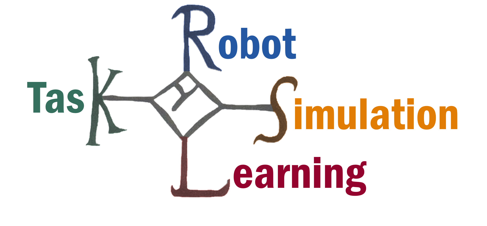

# KAROLOS
[](https://github.com/rlworkgroup/metaworld/blob/master/LICENSE)

__KAROLOS (Open-Source Robot-Task Learning Simulation) is an open-source simulation and reinforcement learning suite.__

<p align="center">

</p>

KAROLOS was developed with a focus on:

- __scalability__: As reinforcement learning algorithms require significant amounts of experience,
KAROLOS enables the parallelization of environments.
This way, you spend less time on data collection and more time on training and prototyping.

-  __modularization__: More and more research in reinforcement learning is looking into the transfer of agents from one environment to another.
KAROLOS was developed to quickly generate environments with different robot-task combinations.


## Getting started

### Installation

First, clone the repository

```
git clone https://github.com/tmdt-buw/karolos
cd karolos
```

Install the dependencies using [Anaconda](https://docs.anaconda.com/anaconda/install/).
```
conda env create -f environment.yml
conda activate karolos
```

Install pytorch according to the [official guide](https://pytorch.org/get-started/locally/).
You don't need ``torchvision`` and ``torchaudio``.
```
conda install pytorch cudatoolkit=11.1 -c pytorch -c conda-forge
```

### Getting Started

Run an experiment by launching a manager

```
python karolos/manager.py
```

You can monitor the progress of your experiment in real-time with a tensorboard

```
tensorboard --logdir results
```

## Contribute to KAROLOS

We welcome you to contribute to this project!

1. You can help us by giving us constructive feedback by opening a new issue if you encountered any bugs or if you have ideas for improvement.

2. We are always grateful for support with the development of KAROLOS.
If you are interested, check out the issues to see what features need to be worked on.
Once you have found an issue which you want to tackle, make sure that nobody else is working on it.
For extensive issues make sure to start a discussion to clarify the scope and design choices of your solution.
Communication is key!

## License

This project is published under the MIT license.

## Citation

Please cite **Karolos** if you use this framework in your publications:
```bibtex
@misc{karolos,
  title = {Karolos: An Open-Source Reinforcement Learning Framework for Robot-Task Environments},
  author = {Bitter, Christian and Thun, Timo and Meisen, Tobias},
  
  publisher = {arXiv},
  year = {2022},
  
  url = {https://arxiv.org/abs/2212.00906},
  doi = {10.48550/ARXIV.2212.00906},
}
```

## Trivia

The name is inspired by the karolus monogram (used in the logo), which was the signature of Charles the Great. 
