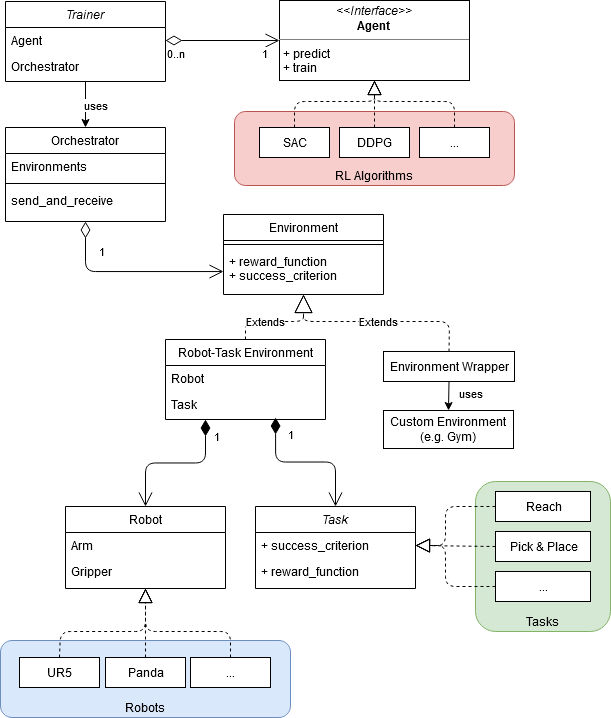

# Architecture

How components work together, mostly interfaces, no inner workings

Set up an experiment by modifying the training config in trainer.py
and starting trainer.py. 
During the initialization of each experiment a folder for saving
tensorboard, models and config files is created in a `results` folder 
at the project root level. 
It is also possible to reload previous experiments by passing
the base_experiment key in the config. 
The environment orchestrator handles the creation and communication
with the `number_envs` environments by spawning each environment
in a process using the native multiprocessing package of python. 
Environments (currently `environment_robot_task.py`) are composed 
of a robot and a task which the user can combine in arbitrary ways.
During initialization the environments return the observation 
and action space to the trainer which initializes 
the agent using these. Additionally the success criterion and the reward
function are passed back to the trainer from the respective task. 
The success criterion is used to determine the test_success_ratio
which is the number of concluded test runs with `success_criterion=True`
compared to the total number of tests for the current test period.
If the previous best ratio
is outperformed, the agent is saved to the model directory.
Success criterion- and reward function are set in the specific 
task file. This file in junction with the task meta class
specifies everything except for the communication with the simulated robot. 
Task objects and robot files are saved in urdf format in the data folder
and read by pybullet which composes the simulation environment. 
Agent files are stored in agents folder, test scripts are also included.